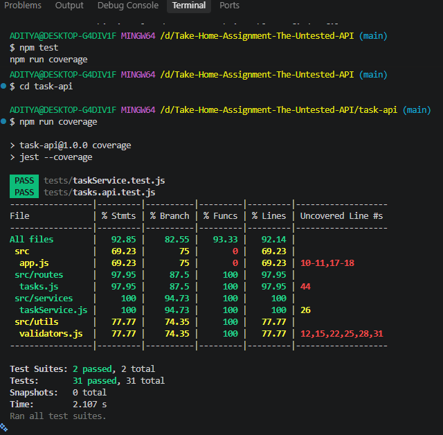

# Take-Home Assignment Submission — The Untested API

## Overview
This submission contains comprehensive test coverage, root cause analysis and fixes for critical bugs discovered in the codebase, and implementation of the `PATCH /tasks/:id/assign` feature along with corresponding regression and validation suites.

---

## Part A: Bug Report

### Bug 1: 0-Based Offset Calculation in Pagination
- **Location:** `src/services/taskService.js` (`getPaginated`) & `src/routes/tasks.js`
- **Expected Behavior:** Requesting page 1 with limit 10 (`?page=1&limit=10`) should return records 0 to 9.
- **Actual Behavior:** The calculation `offset = page * limit` resulted in `offset = 10` on page 1, skipping the first 10 tasks entirely.
- **Root Cause & Fix:** Updated the offset formula to `(Math.max(1, page) - 1) * limit`. Furthermore, normalized combined handling of `status` and `page/limit` in `routes/tasks.js` so pagination operates on filtered subsets instead of raw collections.

### Bug 2: Priority Overwrite on Task Completion
- **Location:** `src/services/taskService.js` (`completeTask`)
- **Expected Behavior:** Completing a task should only update `status: 'done'` and set the `completedAt` timestamp, leaving other task attributes intact.
- **Actual Behavior:** `completeTask` explicitly hardcoded `priority: 'medium'`, which silently downgraded or altered tasks previously marked as `high` or `low`.
- **Root Cause & Fix:** Removed the hardcoded priority mutation to preserve the original task priority.

### Bug 3: Substring Status Collision
- **Location:** `src/services/taskService.js` (`getByStatus`)
- **Expected Behavior:** Filtering tasks by status should strictly match valid statuses (`todo`, `in_progress`, `done`).
- **Actual Behavior:** The use of `status.includes(...)` allowed substring matching, introducing false positive matches across similar status tokens.
- **Root Cause & Fix:** Enforced strict equality check (`t.status === status`).

### Bug 4: Identifier Mutation via Update
- **Location:** `src/services/taskService.js` (`update`)
- **Expected Behavior:** Updates should mutate editable fields (e.g., `title`, `priority`) while preserving immutable metadata.
- **Actual Behavior:** Spreading `fields` directly allowed clients to override internal identifiers like `id` and `createdAt`.
- **Root Cause & Fix:** Destructured and stripped `id` and `createdAt` before applying mutations.

---

## Part B: Implemented Fixes
All identified bugs above were remediated directly in `taskService.js` and `routes/tasks.js`, backed by unit and integration regression tests.

---

## Part C: Feature Implementation — `PATCH /tasks/:id/assign`
- **Design Decisions:**
  - Added `assignee: null` by default to newly created tasks.
  - Added helper `validateAssignTask` in `src/utils/validators.js` that verifies `assignee` is a string and non-empty after trimming.
  - Returns `400 Bad Request` with an explicit error message on missing or whitespace-only assignees.
  - Returns `404 Not Found` if the task does not exist.
  - Allows seamless reassignment if a task already has an existing assignee.

---

## Coverage

Test Suites: 2 passed · Tests: 31 passed  
Statements 92.85% · Branches 82.55% · Functions 93.33% · Lines 92.14%

`taskService` is fully covered. Remaining gaps are the process listen path in `app.js` and a few unused validator branches (invalid priority / dueDate on update).

## What I'd test next
- Invalid JSON / missing `Content-Type`
- Completing an already-completed task
- Overdue boundary when `dueDate` is exactly now
- Pagination metadata (`total`, `page`) if a UI is added

## What surprised me
- README statuses (`pending | in-progress | completed`) do not match the code (`todo | in_progress | done`)
- `GET /tasks` originally treated `status` and pagination as mutually exclusive
- `completeTask` silently overwrote priority to `medium`

## Questions before production
- Should `assignee` be a free-form name or a user id?
- Do we need persistence? The store resets on restart
- Should completed tasks still be re-assignable?